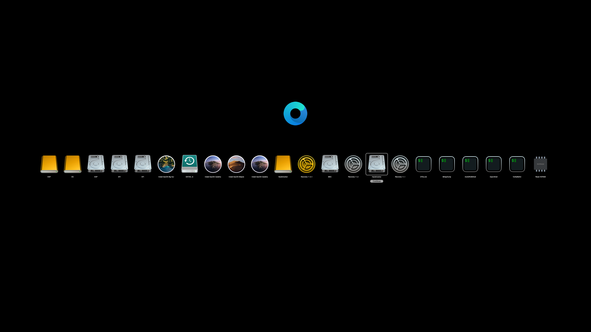
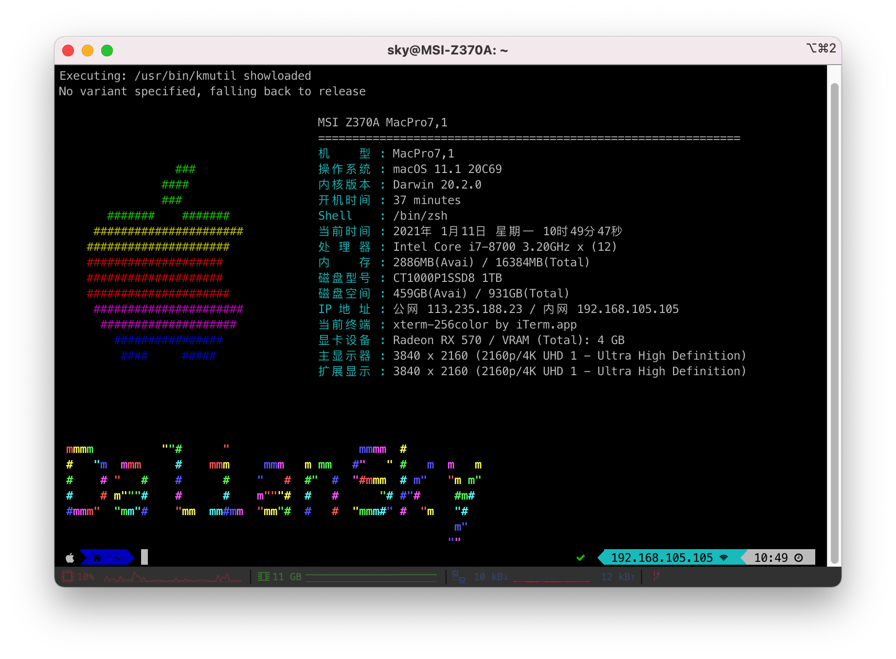
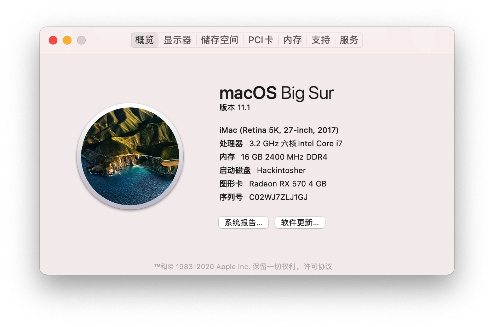
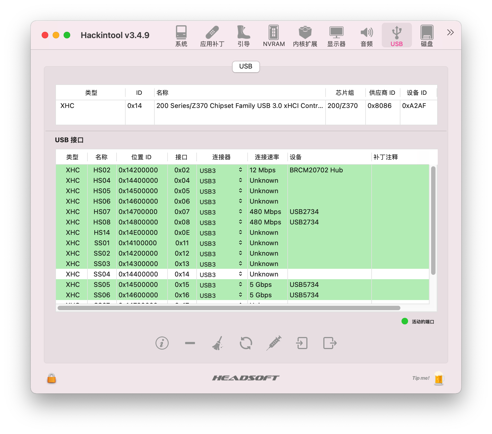
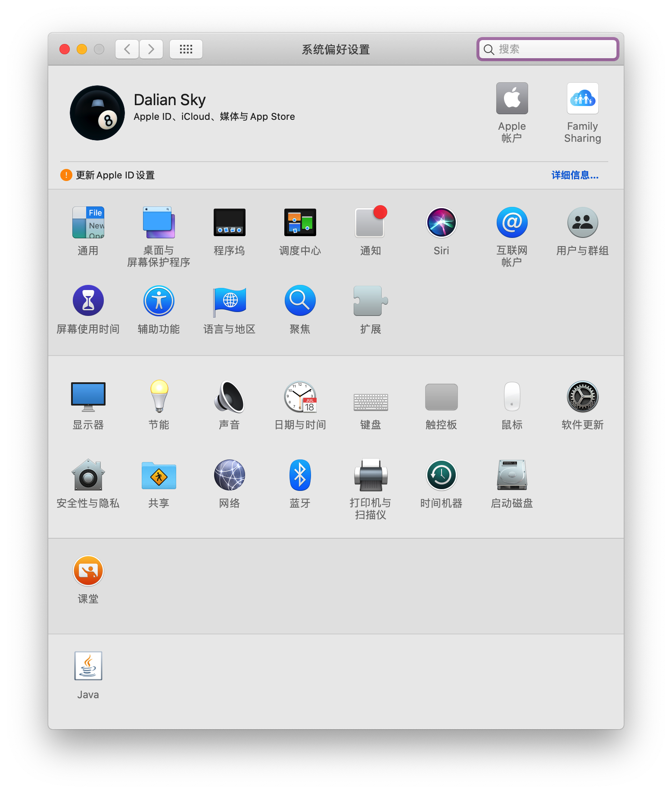

## Z370-A Pro(MS-7B48)配置清单及截屏

> 话说这台机器吃灰怎么也有一年的时间了，最近闲着没事，把它拿出来，将系统更新到最新的`Big Sur`，原则上它也支持`Catalina` / `Mojave`等；同时重新适配了`OpenCore`的引导，顺便也添加了`OpenCore`的引导主题。

### 配置

|   规格   |                           详细信息                           |
| :------: | :----------------------------------------------------------: |
| 主板型号 |                     MSI Z370-A (MS-7B48)                     |
| 操作系统 |                        macOS Big Sur                         |
|  处理器  |                    英特尔® 酷睿™ i7-8700                     |
|   内存   |                             16GB                             |
|  硬盘1   |                       CT1000P1SSD8 1TB                       |
|  硬盘n   | SDEZS25-480G-Z01 WDC WD10EZEX-08WN4A0 WDC WD4000FYYZ-03UL1B3 |
|   显卡   |                        Radeon RX 570                         |
|  显示器  |              **DELL U2718Q** / **DELL U2718Q**               |
|   声卡   |                    Realtek ALC892 alcid=7                    |
|   网卡   |           Realtek 8111 / BCM94360CD四天线无线网卡            |

### 更新日志

- 1-11-2021
  - 更新`OpenCore` `v0.6.6`
  - 更新驱动程序到最新
		

### 截屏

